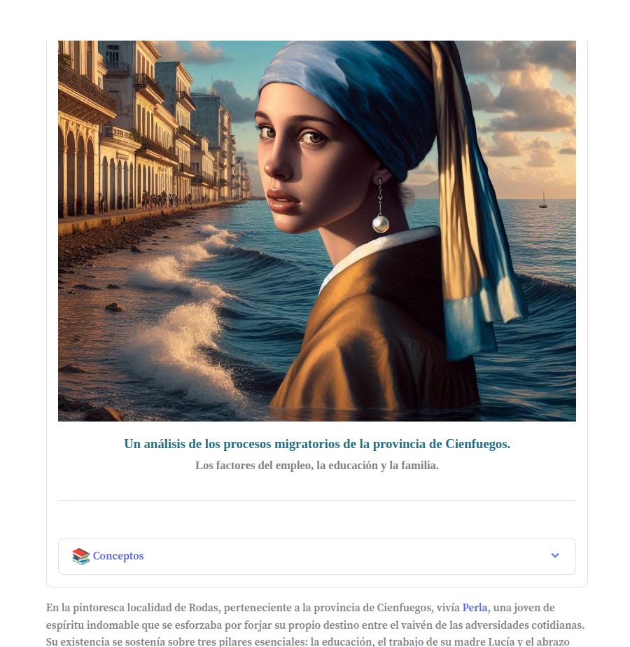

# 
 <h style= "color:SkyBlue;">[**Preview**](https://la-perla-del-sur.streamlit.app/)</h>

### 
 <h3 style= "color:SkyBlue;">**Contents**</h3> 
- [Datos utilizados](data)
- [Scripts](scripts)
- [Formulario de preguntas](form/README.md)
- [Reporte](app/report/report.pdf)
- [Presentación](report/presentation.pdf)