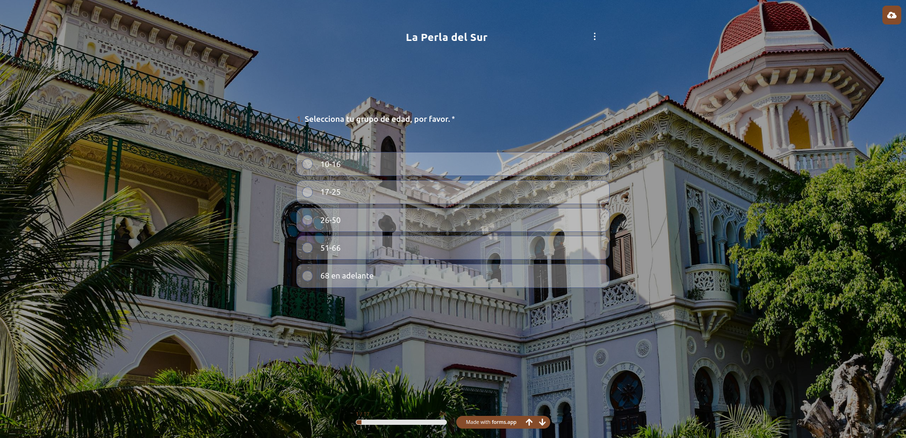
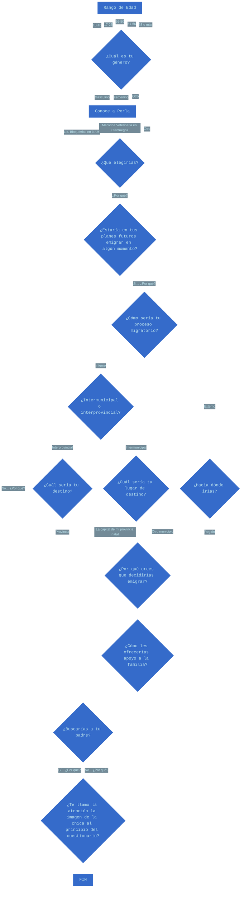

# <h1 align=center><b>Formulario</b></h1>

---

## <h2 align=center><b>Preview:</b></h2>

---
- [**CSV con respuestas**](data/La-Perla-del-Sur-Form.csv)

## <h2 align=center><b>Diagrama de Flujo:</b></h2>

