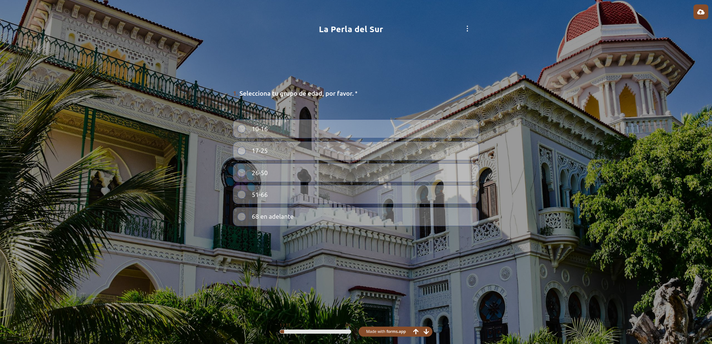

# **Formulario**
---
## **Preview** 
[](https://qqhgi39b.forms.app/la-perla-del-sur)

---

### Diagrama de Flujo:
---

```mermaid
graph TD
    A[Rango de Edad]
    B{¿Cuál es tu género?}
    C[Conoce a Perla]
    D{¿Qué elegirías?}
    E{¿Estaría en tus planes futuros emigrar en algún momento?}
    F{¿Cómo sería tu proceso migratorio?}
    G{¿Intermunicipal o interprovincial?}
    H{¿Cuál sería tu destino?}
    I{¿Por qué crees que decidirías emigrar?}
    J{¿Cómo les ofrecerías apoyo a la familia?}
    K{¿Buscarías a tu padre?}
    L{¿Cuál sería tu lugar de destino?}
    M{¿Hacia dónde irías?}
    N{¿Te llamó la atención la imagen de la chica al principio del cuestionario?}
    X[FIN]

    A --> [10-16] B
    A --> [17-25] B
    A --> [26-50] B
    A --> [51-66] B
    A --> [>=68] B

    B --> [Masculino] C
    B --> [Femenino] C
    B --> [Otro] C

    C --> [Lic. Bioquímica en la UH] D
    C --> [Medicina Veterinaria en Cienfuegos] D
    C --> [Otro] D

    D --> [¿Por qué?] E

    E --> [Sí... ¿Por qué?] F
    E --> [No... ¿Por qué?] K

    F --> [Interno] G
    F --> [Externo] M

    G --> [Intermunicipal] L
    G --> [Interprovincial] H

    H --> [Provincia] I

    I --> J
    J --> K

    K --> [Sí... ¿Por qué?] N
    K --> [No... ¿Por qué?] N

    N --> X
    L --> [La capital de mi provincia natal] I
    L --> [Otro municipio] I
```

---
